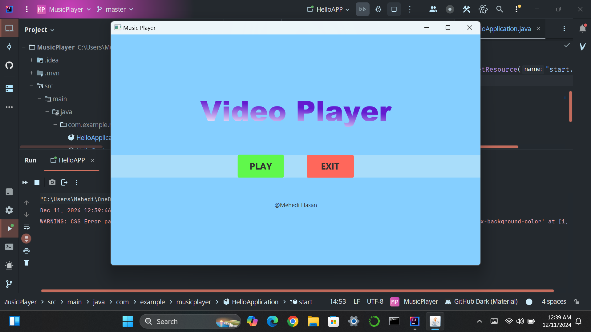
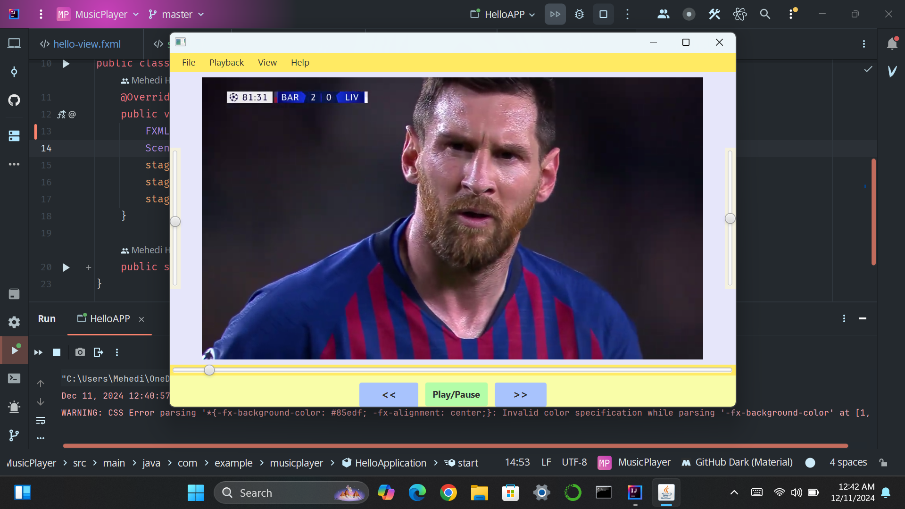

# 🎵 JavaFX Music Player 🎥

A simple yet powerful music and video player application built with **JavaFX**. This project allows users to play, pause, and control media files (audio and video) with a user-friendly interface. 

---

## 🌟 Features

- 📂 **Open Media Files**: Select and play audio or video files from your system.
- ▶️ **Playback Controls**: Play, pause, forward, and rewind the media.
- 🔊 **Volume Control**: Adjust the volume with an interactive slider.
- ⏩ **Seek Media**: Jump to any point in the video using the progress slider.
- 📐 **Scale Media**: Adjust the video size using:
  - **Scale Slider**: Fine-tune the screen size smoothly.
  - **Preset Options**: Quickly set size to 50%, 100%, 150%, or 200%.
- 🔄 **Dynamic Resizing**: Automatically adjusts the media view when scaling.

---

## 🖼️ Screenshots

- **Welcome Page:**
  

- **Player:**
  

---

## 🛠️ How to Run

1. **Prerequisites**:
   - Install [Java JDK 17+](https://www.oracle.com/java/technologies/javase-jdk17-downloads.html).
   - Install [JavaFX SDK](https://openjfx.io/).
   
2. **Clone the Repository**:
   ```bash
   git clone https://github.com/your-repo/JavaFX_VideoPlayer.git
   cd JavaFX_VideoPlayer
   
---

## 🚀 Future Improvements
   - Add support for playlists.
   - Enable drag-and-drop functionality to load media files.
   - Display metadata like title, duration, and resolution.
   - Add themes for a customizable UI.

---

## 🧑‍💻 Author
   - **Mehedi Hasan**
      - 🏫 Undergraduate Student, CSE Department, University of Dhaka
      - 📧 Email: [mehedi-2022415897@cs.du.ac.bd](mailto:mehedi-2022415897@cs.du.ac.bd)
      - 🌐 GitHub: [github.com/hasan-mehedii](https://github.com/hasan-mehedii)
   

   
